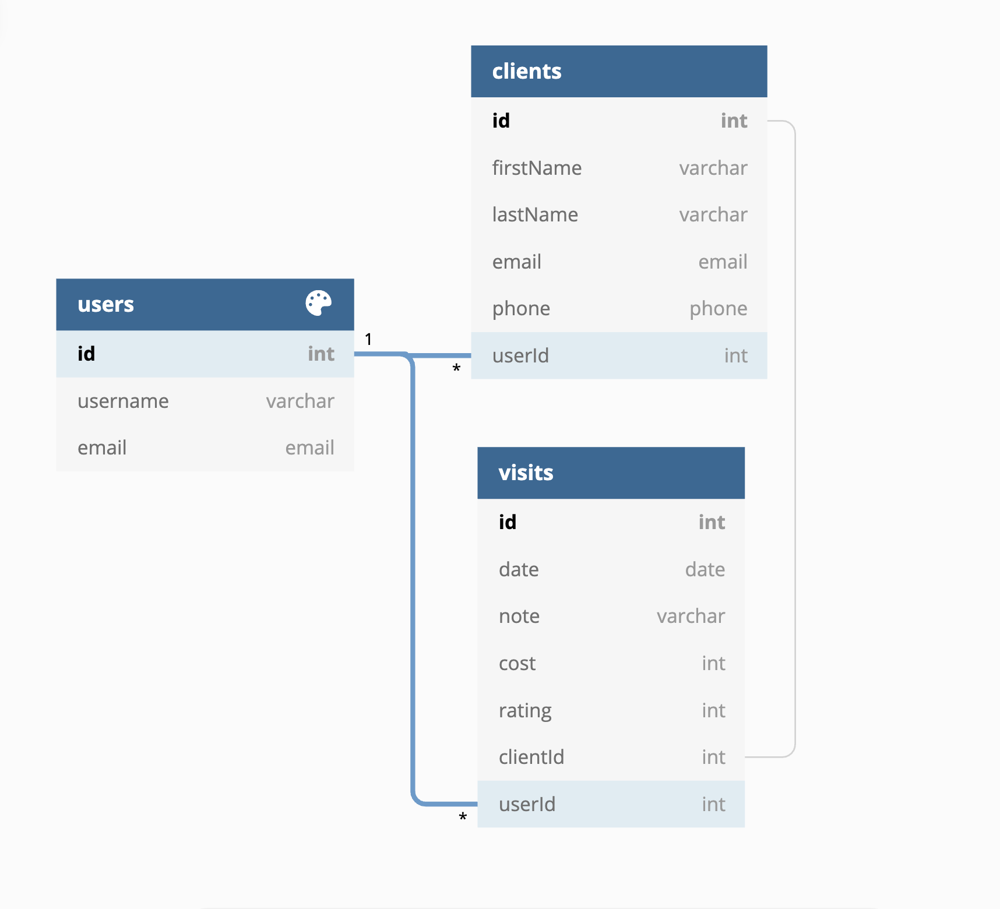

# client recall

## Application Overview

​
client recall is a single page web application for users to organize and save important information about their clients to assist in creating smooth and positive relationships. In this case, the users are hairdressers and the important information, data, is general contact info: name, phone, email, also more specific visit info such as: visit date, cost, a personal rating, photos and notes, i.e. color formulas, haircut details, etc. I created client recall because I personally saw the need for such an app during my ten years as a hairstylist. Myself, and everyone I knew, stored notes on index cards. Those get lost and damaged easily to say the least. Not to mention, that after a year of diligent note taking, you'd have an unwieldy amount of cards. This app solves these problems. client recall takes things a step further and allows the stylist the opportunity to save a photo with each visit. Even furthermore, the stylist can rate their own performance on each visit.

​

## Technologies Used

​
-> This app was built 100% remotely in two and a half weeks with Vanilla Javascript, React, HTML, CSS and JSON Server. I used Figma and DB Diagram to begin the imaginings and inner workings of the app. I used Zoom to participate in daily standups and to stay in contact with my learning team and any fellow student support network.

## Running This Application

​

### First, a note about authentication....

This application uses mock authentication which is purely for demonstration purposes. Therefore the login and registration code written here is completely insecure and would never be implemented in a professional application.
​

### Now that we've cleared that up...

Follow the instructions below to demo this application for yourself!
​

### Installation

1. First thing's first: The app was created to work with a REST API by way of JSON Server. You'll need to install JSON Server in the terminal:
   `npm install -g json server`
2. Next you'll need to clone this repo and cd in to it in the terminal:
   `git clone git@github.com:terraroush/client-recall.git`
   then
   `cd client-recall`
3. You need to install a node package with dependencies (keep this terminal window open):
   `npm install`
4. Along with this repository, you will need to clone the [client recall JSON Server](https://github.com/terraroush/client-recall-JSON) repo as well, which contains the data structure. In a new terminal window:
   `git clone git@github.com:terraroush/client-recall-JSON.git`
   then
   `cd client-recall-JSON`
   from here (this will serve the demo database):
   `json-server -p 8088 -w database.json`
5. From the original terminal window start your own demo:
   `npm start`
6. Log in using one of two demo accounts:

- terra@demo.com (this one has the most data)
- carly@me.com

​

### Demo User Data

​
To quickly get to the data login with the following demo user data:
​
Username: demo
​
Password: 1

## Wireframe v2

## Wireframe v1

## ERD _entity relationship diagram_

